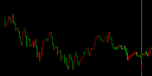

## 使用U-Net模型进行ETH价格趋势预测 Prediction of ETH price using U-Net and Keras

一般价格预测都是用LSTM或RNN，因为是一个典型的时间序列问题。这里使用U-net是因为基于传统技术分析的思路。技术分析是利用价格和交易量的曲线走势或辅助线进行分析，因此考虑价格预测是否可以转化为图形生成的问题。又受到Bert中Mask的启发，所以使用U-net进行尝试，输入历史价格走势曲线的图片，mask住最后几个点，训练模型生成（预测）这几个点的位置。经过不断尝试，可以实现预测价格趋势。以小时线为例，基本可以预测大致的走势，但是预测的时间点越多，后面的预测点会越不准确。所以比较可信的是离历史曲线最近的几个点。


### 2021-02-24 更新：

增加ViT-Unet模型，参考TransUnet（https://arxiv.org/abs/2102.04306），即在Unet底部增加一个Transformer的Encoder。网络性能会比单纯Unet好一些。


### 已实现的功能：

1. 从okex获取ETH以太币的实时价格数据；
2. 生成训练用的价格曲线图片，一个图片有128个数据（例如128个小时数据）。每个数据包括开盘价、收盘价、交易量，上涨用红色表示，下跌用绿色表示，交易量会换算成颜色深浅（取值127-255，值太小就看不见了）；
3. 目前是训练模型预测5个点，可以调整mask_num；
4. 实时预测时，每次预测只取最近的一个点（如上所述，这个点可信度最高），然后把这个点作为历史数据，可以继续进行预测，想预测多长时间的，就重复多少次；
5. 模型使用Keras构建，后端是tensorflow 1.15.4




### 生成数据

```
cd datagen
python3 datagen.py
```
dataset里有一个历史数据csv，可以用来生成训练数据，如果要预测当前趋势，需要实时交易数据。


### 训练Unet

```
cd unet
python3 main.py
```
模型大概训练3-6个epoch，就可以用了。


### 训练ViT-Unet

```
python3 -m vit_unet.train
```


### 预测

```
python3 predict_now.py

python3 predict_vitunet.py
```
默认预测24小时的趋势。predict_now.py会生成一个html，可以放到自己的web server上，方便手机查看。


### 关于交易数据

1. okex获取交易需要梯子，okapi里设置里代理，需要改成你的梯子
2. okex需要申请一个api接入账号，看这里 https://www.okex.com/docs/zh/#README


### Pre-trained Model

Unet 链接: https://pan.baidu.com/s/146DeSixN_RDZe84ggS_ByA 提取码: 726u

ViT-Unet 链接: https://pan.baidu.com/s/1uBDnlJAKWV3Lpyjx7ZYWLw 提取码: 8hfx 


### TODO

1. 把预测结果中价格数据量化
2. 尝试其他生成模型


### 模型参考

https://github.com/zhixuhao/unet

https://github.com/Lsdefine/attention-is-all-you-need-keras